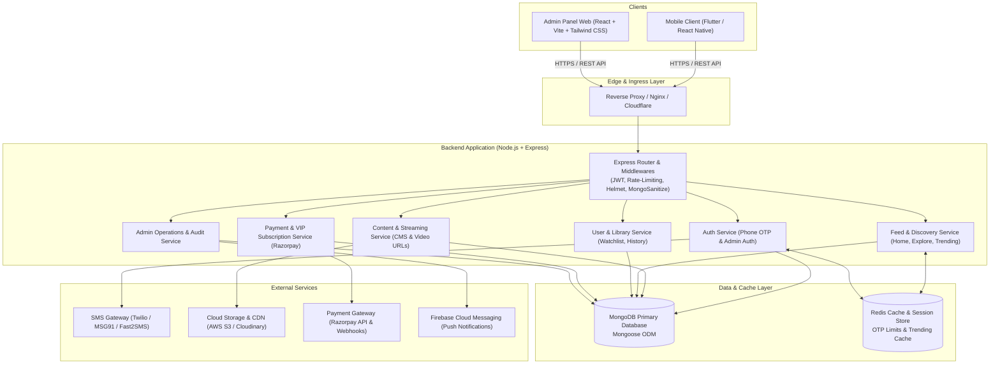

# Architecture & System Design Document
## Project: E² Stories (Entertainment Squared) — Backend & Admin Panel

---

## 1. High-Level System Architecture



---

## 2. Technology Stack Breakdown

| Component | Technology | Rationale |
| :--- | :--- | :--- |
| **Backend Runtime** | Node.js (v20+ LTS) | Non-blocking, asynchronous I/O ideal for high-throughput streaming metadata and concurrent mobile app requests. |
| **Framework** | Express.js (JavaScript ES6+) | Lightweight, minimalist, well-supported middleware ecosystem, rapid REST API development. |
| **Primary Database**| MongoDB with Mongoose ODM | Document-oriented model suits flexible video metadata, nested subtitle tracks, genre tags, and fast query reads. |
| **In-Memory Cache** | Redis (ioredis) | Sub-millisecond caching for Home feeds, trending rankings, OTP expiration cooldowns, and request throttling. |
| **Admin Panel** | React.js (Vite) + Tailwind CSS | Fast bundle size, rapid UI component authoring, and sleek SaaS aesthetics matching the modern reference layout. |
| **Storage & Video** | AWS S3 / Cloudinary CDN | High-durability object storage for vertical 9:16 video clips, trailer previews, posters, and subtitle tracks. |
| **Payments** | Razorpay (Node SDK) | Native INR support (₹199 / ₹1499), UPI, cards, and signed webhook validation for instant VIP status activation. |
| **SMS / Push** | MSG91 / Twilio & Firebase FCM | Fast SMS delivery for Indian numbers (+91) and real-time push alerts for new episode drops. |

---

## 3. Database Schema & Mongoose Data Models

### 3.1 `User` Model
```javascript
const UserSchema = new mongoose.Schema({
  phoneNumber: { type: String, required: true, unique: true, index: true }, // e.g. "+919876543210"
  countryCode: { type: String, default: "+91" },
  firstName: { type: String, trim: true, default: "" },
  lastName: { type: String, trim: true, default: "" },
  email: { type: String, lowercase: true, trim: true, index: true },
  avatarUrl: { type: String, default: "" },
  
  // Onboarding & Preferences
  interests: [{ type: mongoose.Schema.Types.ObjectId, ref: 'Genre' }],
  preferredContentLanguages: { 
    type: [String], 
    default: ["Hindi", "English"],
    enum: ["Hindi", "English", "Tamil", "Telugu", "Kannada", "Malayalam"] 
  },
  
  // Playback & Notification Settings
  settings: {
    autoplayNext: { type: Boolean, default: true },
    videoQuality: { type: String, enum: ["Auto", "1080p", "720p"], default: "Auto" },
    appLanguage: { type: String, default: "English" },
    notifications: {
      newEpisodes: { type: Boolean, default: true },
      newReleases: { type: Boolean, default: true },
      recommendations: { type: Boolean, default: false }
    }
  },
  
  // VIP & Subscription Status
  isVip: { type: Boolean, default: false, index: true },
  vipExpiresAt: { type: Date, default: null },
  currentSubscriptionId: { type: mongoose.Schema.Types.ObjectId, ref: 'Subscription', default: null },

  // System & Status
  status: { type: String, enum: ['ACTIVE', 'SUSPENDED', 'DELETED'], default: 'ACTIVE' },
  fcmTokens: [{ type: String }],
  lastLoginAt: { type: Date, default: Date.now }
}, { timestamps: true });
```

### 3.2 `Genre` Model
```javascript
const GenreSchema = new mongoose.Schema({
  name: { type: String, required: true, unique: true, trim: true }, // "Romance", "Thriller", "Drama"
  slug: { type: String, required: true, unique: true, lowercase: true },
  iconUrl: { type: String, required: true },
  displayOrder: { type: Number, default: 0 },
  isActive: { type: Boolean, default: true }
}, { timestamps: true });
```

### 3.3 `Drama` (Series) Model
```javascript
const DramaSchema = new mongoose.Schema({
  title: { type: String, required: true, trim: true, index: true },
  slug: { type: String, required: true, unique: true, lowercase: true },
  synopsis: { type: String, required: true },
  
  // Media Assets
  posterUrl: { type: String, required: true }, // 9:16 vertical poster
  bannerUrl: { type: String, required: true }, // 16:9 carousel banner
  trailerUrl: { type: String, required: true }, // 9:16 vertical trailer clip
  
  // Categorization
  genres: [{ type: mongoose.Schema.Types.ObjectId, ref: 'Genre', index: true }],
  languages: [{ type: String, default: ["Hindi"] }],
  tags: [{ type: String }],
  
  // Metadata & Stats
  releaseDate: { type: Date, default: Date.now },
  totalEpisodes: { type: Number, default: 0 },
  viewsCount: { type: Number, default: 0, index: true },
  rating: { type: Number, default: 4.8 },
  
  // Curation Flags
  isTrending: { type: Boolean, default: false, index: true },
  trendingRank: { type: Number, default: null }, // 1, 2, 3...
  isFeatured: { type: Boolean, default: false, index: true }, // Hero carousel
  isNewRelease: { type: Boolean, default: true, index: true },
  
  status: { type: String, enum: ['DRAFT', 'PUBLISHED', 'ARCHIVED'], default: 'PUBLISHED', index: true }
}, { timestamps: true });
```

### 3.4 `Episode` Model
```javascript
const EpisodeSchema = new mongoose.Schema({
  dramaId: { type: mongoose.Schema.Types.ObjectId, ref: 'Drama', required: true, index: true },
  seasonNumber: { type: Number, default: 1 },
  episodeNumber: { type: Number, required: true }, // 1, 2, 3, 4...
  title: { type: String, required: true }, // e.g. "Episode 02" or specific title
  synopsis: { type: String, default: "" },
  thumbnailUrl: { type: String, required: true },
  
  // Streaming URLs
  videoStreamUrl: { type: String, required: true }, // HLS .m3u8 or MP4 stream
  resolutions: [{
    quality: { type: String, enum: ['720p', '1080p'] },
    url: { type: String, required: true }
  }],
  durationSeconds: { type: Number, required: true }, // e.g. 135 (2:15)
  
  // Subtitles
  subtitles: [{
    language: { type: String, required: true }, // "Hindi", "English"
    url: { type: String, required: true } // .vtt / .srt file
  }],
  
  // Monetization Gate
  isFree: { type: Boolean, default: false, index: true }, // True for Ep 1-3, False for Ep 4+
  viewsCount: { type: Number, default: 0 }
}, { timestamps: true });

EpisodeSchema.index({ dramaId: 1, seasonNumber: 1, episodeNumber: 1 }, { unique: true });
```

### 3.5 `WatchHistory` & `ContinueWatching` Model
```javascript
const WatchHistorySchema = new mongoose.Schema({
  userId: { type: mongoose.Schema.Types.ObjectId, ref: 'User', required: true, index: true },
  dramaId: { type: mongoose.Schema.Types.ObjectId, ref: 'Drama', required: true, index: true },
  episodeId: { type: mongoose.Schema.Types.ObjectId, ref: 'Episode', required: true },
  
  watchedSeconds: { type: Number, required: true, default: 0 },
  durationSeconds: { type: Number, required: true },
  progressPercentage: { type: Number, default: 0 }, // (watchedSeconds / durationSeconds) * 100
  isCompleted: { type: Boolean, default: false },
  lastWatchedAt: { type: Date, default: Date.now, index: true }
}, { timestamps: true });

WatchHistorySchema.index({ userId: 1, dramaId: 1 }, { unique: true });
```

### 3.6 `Watchlist` (Saved Series) Model
```javascript
const WatchlistSchema = new mongoose.Schema({
  userId: { type: mongoose.Schema.Types.ObjectId, ref: 'User', required: true, index: true },
  dramaId: { type: mongoose.Schema.Types.ObjectId, ref: 'Drama', required: true, index: true },
  addedAt: { type: Date, default: Date.now }
}, { timestamps: true });

WatchlistSchema.index({ userId: 1, dramaId: 1 }, { unique: true });
```

### 3.7 `SubscriptionPlan` & `Subscription` Model
```javascript
const SubscriptionPlanSchema = new mongoose.Schema({
  code: { type: String, required: true, unique: true }, // 'MONTHLY', 'YEARLY'
  title: { type: String, required: true }, // "Monthly Plan", "Yearly Plan"
  amountInr: { type: Number, required: true }, // 199, 1499
  durationDays: { type: Number, required: true }, // 30, 365
  perks: [{ type: String }],
  isActive: { type: Boolean, default: true }
}, { timestamps: true });

const SubscriptionSchema = new mongoose.Schema({
  userId: { type: mongoose.Schema.Types.ObjectId, ref: 'User', required: true, index: true },
  planId: { type: mongoose.Schema.Types.ObjectId, ref: 'SubscriptionPlan', required: true },
  amountPaid: { type: Number, required: true },
  currency: { type: String, default: "INR" },
  
  // Razorpay IDs
  razorpayOrderId: { type: String, required: true, unique: true },
  razorpayPaymentId: { type: String },
  razorpaySignature: { type: String },
  
  status: { type: String, enum: ['PENDING', 'ACTIVE', 'EXPIRED', 'FAILED'], default: 'PENDING' },
  startsAt: { type: Date },
  expiresAt: { type: Date, index: true }
}, { timestamps: true });
```

### 3.8 `AdminUser` & `AuditLog` Model
```javascript
const AdminUserSchema = new mongoose.Schema({
  name: { type: String, required: true },
  email: { type: String, required: true, unique: true, lowercase: true },
  passwordHash: { type: String, required: true },
  role: { type: String, enum: ['SUPER_ADMIN', 'CONTENT_MANAGER', 'FINANCE'], default: 'CONTENT_MANAGER' },
  isActive: { type: Boolean, default: true }
}, { timestamps: true });

const AuditLogSchema = new mongoose.Schema({
  adminId: { type: mongoose.Schema.Types.ObjectId, ref: 'AdminUser', required: true, index: true },
  adminEmail: { type: String, required: true },
  action: { type: String, required: true }, // "CREATE_DRAMA", "UPDATE_EPISODE", "OVERRIDE_VIP"
  targetEntity: { type: String, required: true }, // "Drama", "Episode", "User"
  entityId: { type: String, required: true },
  changes: { type: mongoose.Schema.Types.Mixed }, // { before: {...}, after: {...} }
  ipAddress: { type: String },
  userAgent: { type: String }
}, { timestamps: true });
```

---

## 4. API Specification & Endpoints

### 4.1 Client Auth Endpoints (`/api/v1/auth`)
- `POST /api/v1/auth/request-otp`: Request 4-digit SMS OTP for a phone number.
- `POST /api/v1/auth/verify-otp`: Validate OTP, create or return user, generate JWT auth token.
- `POST /api/v1/auth/profile`: Update first name, last name, and email during onboarding.
- `POST /api/v1/auth/interests`: Save selected genre interests.

### 4.2 Home & Feed Endpoints (`/api/v1/feed`)
- `GET /api/v1/feed/home`: Composite home payload (Hero Carousel, Continue Watching, Trending 1-3, Recommended For You, Popular Genres, New Releases).
- `GET /api/v1/feed/continue-watching`: Paginated list of user's in-progress series.
- `GET /api/v1/feed/trending`: Ranked trending list.
- `GET /api/v1/feed/explore`: Vertical reels swipe feed of drama trailers.

### 4.3 Drama & Video Player Endpoints (`/api/v1/dramas`)
- `GET /api/v1/dramas/:id`: Drama details, genres, total episodes, user watchlist status.
- `GET /api/v1/dramas/:id/episodes`: Full episodes drawer list with locked/unlocked VIP status.
- `GET /api/v1/dramas/:id/episodes/:episodeNumber/stream`: Secure stream token & video playback URL with subtitles. Validates user's VIP membership if episode is paywalled.
- `POST /api/v1/dramas/:id/episodes/:episodeNumber/progress`: Heartbeat to sync resume playback timestamp.

### 4.4 User Library & Settings (`/api/v1/user`)
- `GET /api/v1/user/profile`: Profile info, VIP expiration, library counts.
- `GET /api/v1/user/saved-series`: Saved watchlist.
- `POST /api/v1/user/saved-series/:dramaId`: Toggle drama in watchlist (+ / -).
- `GET /api/v1/user/watch-history`: History listing with resume timestamps.
- `PUT /api/v1/user/settings`: Update autoplay, video quality, content languages, notification toggles.
- `POST /api/v1/user/delete-account`: Initiate account soft-deletion and cancel subscriptions.

### 4.5 Search Endpoints (`/api/v1/search`)
- `GET /api/v1/search?q=`: Full-text search across titles, synopses, and genres.
- `GET /api/v1/search/recent`: User's recent search queries.
- `DELETE /api/v1/search/recent`: Clear user's recent search queries (single or all).
- `GET /api/v1/search/popular`: Aggregated top searches (`01, 02, 03`).

### 4.6 Monetization & Subscription Endpoints (`/api/v1/subscriptions`)
- `GET /api/v1/subscriptions/plans`: List active plans (₹199 / ₹1499).
- `POST /api/v1/subscriptions/create-order`: Create Razorpay order ID.
- `POST /api/v1/subscriptions/verify-payment`: Verify Razorpay signature and activate VIP status.
- `POST /api/v1/subscriptions/webhook`: Razorpay asynchronous server-to-server webhook.

### 4.7 Admin Operations Endpoints (`/api/v1/admin`)
- `POST /api/v1/admin/auth/login`: Admin email/password login returning Admin JWT.
- `GET /api/v1/admin/analytics/overview`: Dashboard KPI counts, MRR, views, DAU.
- `GET /api/v1/admin/dramas`: Paginated series table with search, status filters.
- `POST /api/v1/admin/dramas`: Create drama (with file upload presigned URLs).
- `PUT /api/v1/admin/dramas/:id`: Update drama metadata or status.
- `POST /api/v1/admin/dramas/:id/episodes`: Add/upload episodes with subtitles.
- `GET /api/v1/admin/users`: User management table with VIP status filter and search.
- `PATCH /api/v1/admin/users/:id/vip`: Manual VIP grant/revoke override.
- `GET /api/v1/admin/audit-logs`: Paginated audit trail with CSV export.

---

## 5. Admin Panel Architecture (Frontend)

The Admin Panel is structured as a single-page application (SPA) using React 18 and Vite:
- **Routing**: `react-router-dom` with private route guards verifying Admin JWT.
- **State Management**: TanStack Query (React Query) for server state caching and optimistic UI updates; Zustand for local app state (authenticated admin profile, active drawer/modal).
- **Styling**: Tailwind CSS configured with Urbanist font and custom color tokens (Deep Black `#080B08`, Soft Card `#16161D`, Accent Pastel Yellow `#FEF08A`, Lime Accent `#8FFE01`).
- **Data Visualization**: Recharts for audit activity histograms, daily views, and MRR growth curves.
- **Data Tables**: Headless table components supporting multi-column sorting, search filters, pagination, and CSV export.
